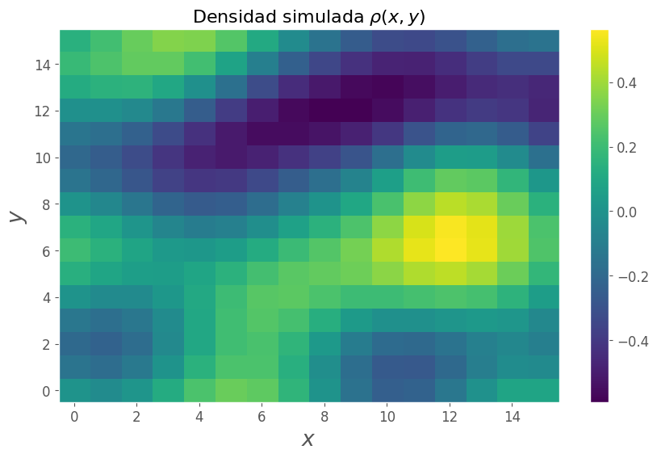
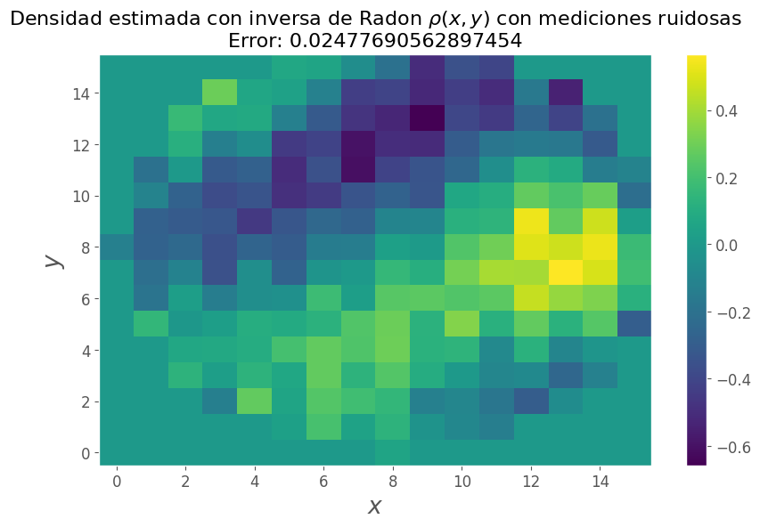

# Tarea 1

En este Jupyter Notebook, incluimos una simulación de reconstrucción de imágenes dada su transformada de Radon.

* Curso: Problemas Inversos y de Control de EDP (MA5306)
* Profesor de Cátedra: Axel Osses A.
* Profesor Auxiliar: Jorge Aguayo
* Estudiante: Johnny Godoy

# Preliminar

Imports


```python
import platform
import random

import matplotlib.pyplot as plt
import numpy as np
import scipy.integrate
import skimage.transform
import tabulate

from perlin_numpy import generate_perlin_noise_2d
```

Configuraciones


```python
print(tabulate.tabulate(platform.uname()._asdict().items()))

plt.style.use('ggplot')
plt.rc('axes', titlesize=14)
plt.rc('legend', fontsize=14)
plt.rc('xtick', labelsize=12)
plt.rc('ytick', labelsize=12)
plt.rcParams.update({'font.size': 16})
plt.rcParams['axes.titlesize'] = 16
plt.rcParams["figure.figsize"] = (10, 6)
plt.rcParams.update({'lines.markeredgewidth': 1})
plt.rcParams.update({'errorbar.capsize': 2})
```

    -------  ----------
    system   Windows
    node     GOEDEL
    release  10
    version  10.0.19044
    machine  AMD64
    -------  ----------
    

Constantes


```python
TAMAÑO_IMAGEN = 16
ANGULOS_DE_RAYOS = np.arange(0, 210, 30)
```

Función de utilidad


```python
def ver_imagen(arreglo_imagen: np.ndarray,
               titulo: str,
               etiqueta_x: str = "$x$",
               etiqueta_y: str = "$y$",
               extent: list = None):
    plt.imshow(arreglo_imagen, origin="lower", extent=extent, aspect='auto')
    plt.colorbar()
    plt.title(titulo)
    plt.xlabel(etiqueta_x)
    plt.ylabel(etiqueta_y)
    plt.grid()
```

# Simulando datos de una tomografía

Generaremos un arreglo de densidades a través de ruido de Perlin 2D. Este arreglo será considerado desconocido, y es lo que queremos encontrar.


```python
np.random.seed(0)
densidades_simuladas = generate_perlin_noise_2d((TAMAÑO_IMAGEN, TAMAÑO_IMAGEN), (2, 2))
ver_imagen(densidades_simuladas, r"Densidad simulada $\rho(x, y)$")
```


    

    


# Calculando la transformada

Esto se logra con `skimage.transform.radon`. Consideramos este arreglo como el cual realmente podemos medir:


```python
transformada_simulada = skimage.transform.radon(densidades_simuladas,
                                                theta=ANGULOS_DE_RAYOS)
ver_imagen(transformada_simulada, "Pérdida de intensidad de rayos simulados",
           "Ángulo del rayo", "Proyección", extent=[0, 180, 0, 16])
plt.xticks = ANGULOS_DE_RAYOS
```

    C:\Users\David\AppData\Local\Programs\Python\Python310\lib\site-packages\skimage\transform\radon_transform.py:75: UserWarning: Radon transform: image must be zero outside the reconstruction circle
      warn('Radon transform: image must be zero outside the '
    


    

    


# Reconstrucción

## Optimización

Dado $\tilde{R}$ la transformada de Radon medida, podemos encontrar la densidad resolviendo el siguiente problema de optimización:

$$
\min_{\rho\in \mathbb{R}^{16\times 16}} \Vert R(\rho) - \tilde{R} \Vert_2^2
$$


```python
def costo(densidad_cantidata, transformada=transformada_simulada):
    como_imagen = densidad_cantidata.reshape(TAMAÑO_IMAGEN, TAMAÑO_IMAGEN)
    transformada_candidata = skimage.transform.radon(como_imagen, theta=ANGULOS_DE_RAYOS)
    error = transformada_candidata - transformada
    return (error*error).mean()


def error(densidades_estimadas):
    diff = densidades_estimadas - densidades_simuladas
    return (diff*diff).mean()
```

Suponemos que si bien no tenemos acceso a las densidades, sí lo tenemos a su promedio.

Así, construimos un punto inicial para la optimización como una imagen constante con valor igual a esta densidad promedio en todo punto.


```python
densidades_iniciales = densidades_simuladas.mean()*np.ones_like(densidades_simuladas).flatten()
solucion = scipy.optimize.minimize(fun=costo, x0=densidades_iniciales)
print(solucion.message, f"\nError en transformadas: {solucion.fun}")
```

    Optimization terminated successfully. 
    Error en transformadas: 8.174383816688407e-08
    


```python
densidades_optimizadas = solucion.x.reshape(TAMAÑO_IMAGEN, TAMAÑO_IMAGEN)
ver_imagen(densidades_optimizadas, r"Densidad estimada con optimización $\rho(x, y)$"
           + f"\nError: {error(densidades_optimizadas)}")
```


    

    


La solución es casi idéntica a lo que buscamos reconstruir, con un error de orden $10^{-8}$ en las transformadas, y un error de $10^{-3}$ en la imagen original.

Así, se puede reconstruir la imagen (i.e., resolver el problema inverso) con un método simple de optimización, asumiendo que tenemos acceso a una función que calcule la transformada de Radon (i.e., que resuelve el problema directo). 

En la práctica esto no es problema, pues calcular la transformada de Radon solamente requiere integrales a lo largo de un rayo.

Cabe destacar que si bien el supuesto usual es que proveemos de la transformada de Radon completa (es decir, su evaluación para cualquier recta), la reconstrucción solamente requirió utilizar 7 rectas.

Sin embargo, puede ser más desafiente escalar esta metodología para imágenes más grandes, pues una de $16\times16$ ya requirió $20$ segundos para resolver.


## Con la transformada de Radon inversa

Como vimos en el informe, existen fórmulas para invertir la transformada de Radon. El resultado obtenido es como tal:


```python
densidades_iradon = skimage.transform.iradon(transformada_simulada)
ver_imagen(densidades_iradon, r"Densidad estimada con inversa de Radon $\rho(x, y)$"
           + f"\nError: {error(densidades_iradon)}")
```


    

    


El error cuadrático medio aumentó considerablemente a orden $10^{-1}$. Si cabe destacar que el tiempo de ejecución es mucho más veloz.

Agregamos rayos por si esto mejora la solución:


```python
transformada_simulada_letal = skimage.transform.radon(densidades_simuladas)
densidades_iradon_letal = skimage.transform.iradon(transformada_simulada_letal)
ver_imagen(densidades_iradon_letal, r"Densidad estimada con inversa de Radon $\rho(x, y)$ y grandes dosis"
           + f"\nError: {error(densidades_iradon_letal)}")
```


    

    


Parece ser que la implementación de `skimage` asume propiedades del dominio estudiado, como ser 0 fuera del círculo.

## Método híbrido

En búsqueda de sacar lo mejor de dos mundos, podemos utilizar la estimación dada por la transformada inversa como punto inicial del algoritmo de optimización, y así requerir menos iteraciones.


```python
solucion = scipy.optimize.minimize(fun=costo, x0=densidades_iradon)
densidades_hibrido = solucion.x.reshape(TAMAÑO_IMAGEN, TAMAÑO_IMAGEN)
ver_imagen(densidades_hibrido, r"Densidad estimada con optimización desde la transformada inversa $\rho(x, y)$"
           + f"\nError: {error(densidades_hibrido)}")
```


    

    


Este punto inicial no fue mejor que la densidad constante igual a la media, pero sí se puede encontrar sin supuestos de tener dicha media disponible.

# Estabilidad al ruido

Estudiaremos que ocurre si agregamos ruido a las mediciones.

Generando mediciones ruidosas


```python
r, c = transformada_simulada.shape
ruido = np.empty((r*c,))
ruido[::2] = 1
ruido[1::2] = -1
ruido = ruido.reshape((r, c))/5
ver_imagen(ruido, "Ruido agregado")
```


    

    


```python
transformada_ruidosa = ruido + transformada_simulada
ver_imagen(transformada_ruidosa, "Pérdida de intensidad de rayos medidos con ruido",
           "Ángulo del rayo", "Proyección", extent=[0, 180, 0, 16])
plt.xticks = ANGULOS_DE_RAYOS
```


    

    


## Transformada inversa


```python
densidades_iradon_ruisoda = skimage.transform.iradon(transformada_ruidosa)
ver_imagen(densidades_iradon_ruisoda, r"Densidad estimada con inversa de Radon $\rho(x, y)$ con mediciones ruidosas"
           + f"\nError: {error(densidades_iradon_ruisoda)}")
```


    

    


## Optimización


```python
solucion_ruidosa = scipy.optimize.minimize(fun=costo, x0=densidades_iniciales, args=(transformada_ruidosa))
print(solucion_ruidosa.message, f"\nError en transformadas: {solucion_ruidosa.fun}")
densidades_optimizadas_ruidosas = solucion_ruidosa.x.reshape(TAMAÑO_IMAGEN, TAMAÑO_IMAGEN)
ver_imagen(densidades_optimizadas_ruidosas, r"Densidad estimada con optimización $\rho(x, y)$ con mediciones ruidosas"
           + f"\nError: {error(densidades_optimizadas_ruidosas)}")
```

    Optimization terminated successfully. 
    Error en transformadas: 0.0007145819752819582
    


    

    


En ambos casos, vemos que agregar un ruido de amplitud $0.5$ duplica el error de la estimación. Esto puede ser evidencia de la inestabilidad.

# Regularización

Para reducir los problemas de inestabilidad, probamos resolver el siguiente problema regularizado:

$$
\min_{\rho\in \mathbb{R}^{16\times 16}} \Vert R(\rho) - \tilde{R} \Vert_2^2 + \nu\Vert \rho \Vert_2^2 
$$

Para algún $\nu>0$ por elegir. Utilizamos la solución del problema anterior como punto inicial de la optimización.


```python
def costo_regularizado(densidad_candidata, nu):
    norma = np.sum(densidad_candidata*densidad_candidata)
    return costo(densidad_candidata, transformada_ruidosa) + nu*norma
```

Por tanteo, probamos $\nu=2^{-7}$


```python
nu = 2**(-7)
solucion_regularizada = scipy.optimize.minimize(fun=costo_regularizado, x0=densidades_optimizadas_ruidosas, args=(nu))
print(solucion_regularizada.message, f"\nError en transformadas: {solucion_regularizada.fun}")
densidades_regularizadas = solucion_regularizada.x.reshape(TAMAÑO_IMAGEN, TAMAÑO_IMAGEN)
ver_imagen(densidades_regularizadas, r"Densidad estimada con optimización regularizada $\rho(x, y)$ con mediciones ruidosas"
           + f"\nError: {error(densidades_regularizadas)}")
```

    Optimization terminated successfully. 
    Error en transformadas: 0.14983121207534944
    


    

    


Este valor de $\nu$ logra efectivamente reducir el error de `5.23e-3` a`4.35e-3`, es decir, reduce parcialmente la importancia del ruido.
